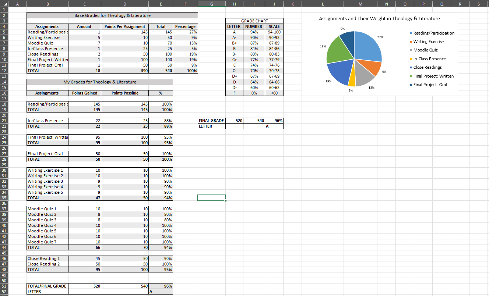

# Video Editor

### About Me 
Hello! I am a current university student and video editing professional with over 5 years of proven expertise in the Communications and Media field with a focus in Digital Media and Video Editing. 

With skills in Premiere Pro, Excel, Data Analysis, and Design, I am able to organize files for video projects effectively, and produce detail oriented videos. I am adept at using Premiere Pro, Excel, and basic Python. 

My diverse skill set, commitment to perfection, and passion for all aspects of production make me as a valuable asset. In my spare time, I like to explore local gems and expand my photography knowledge. 

You can find me on [LinkedIn](https://www.linkedin.com/in/sophia-correale-a6a075340/), [Adobe Portfolio](https://www.instagram.com/phiac.mp4?utm_source=ig_web_button_share_sheet&igsh=ZDNlZDc0MzIxNw==), and [Instagram](https://www.instagram.com/phiac.mp4?utm_source=ig_web_button_share_sheet&igsh=ZDNlZDc0MzIxNw==)


### Education 
BA in Communication and Media at 
Loyola University, MD

### Projects

#### Excel Grade Calculator 



Initial Project Idea:
The assignment was to create a grade calculator in excel for my Beginner Computer Science class. It became useful to me throughout my time at Loyola because I was able to calculate my grade for each of my classes. 

Tools I Used:
I utilized the videos that my teacher had posted for this lesson, I asked my teacher questions, and I asked my classmates as well. 

Challenges I Faced:
I struggled with the layout of my grade calculator. I also got confused with what calculations need to be made where. Both of these obstacles were solved by talking to one of my classmates, we worked out the problem together by drawing it out on the chalk board. 

Result:
I set out to make a grade calculator in a way that was visually appealing for me, and I did just that. I think that I could improve it even further by making the same set up for all of my other classes and then finding the total of all of them together for my overall GPA. 

***
#### Python Grade Calculator

```
print("Course Grade Evaluator")

name1 = input("\nPlease enter your name: ")

print("\nQuiz Scores: ")
quiz1 = float(input("Please enter the score for Quiz 1: "))
quiz2 = float(input("Please enter the score for Quiz 2: "))
quiz3 = float(input("Please enter the score for Quiz 3: "))
quiz4 = float(input("Please enter the score for Quiz 4: "))

print("\nAssessment Scores: ")
test1 = float(input("Please enter the score for Assessment 1: "))
test2 = float(input("Please enter the score for Assessment 2: "))
test3 = float(input("Please enter the score for Assessment 3: "))

print("\n")
print(name1)

quiztotal = quiz1 + quiz2 + quiz3 + quiz4 
quiznum = 4
quizave = quiztotal/quiznum
quizave = round(quizave, 2)
print(f"Quiz average is: {quizave}")

if 90 < quizave:
    print("Quiz letter grade: A")
elif 80 <= quizave <= 89.99:
    print("Quiz letter grade: B")
elif 70 <= quizave <= 79.99:
    print("Quiz letter grade: C")
elif 60 <= quizave <= 69.99:
    print("Quiz letter grade: D")
elif 60 > quizave:
    print("Quiz letter grade: F")

testtotal = test1 + test2 + test3
testnum = 3
testave = testtotal/testnum
testave = round(testave, 2)
print(f"Assessment average is: {testave}")

if 90 < testave:
    print("Test letter grade: A")
elif 80 <= testave <= 89.99:
    print("Test letter grade: B")
elif 70 <= testave <= 79.99:
    print("Test letter grade: C")
elif 60 <= testave <= 69.99:
    print("Test letter grade: D")
elif 60 > testave:
    print("Test letter grade: F")

unwtotal = quiztotal + testtotal 
quiztestnum = 7
unwaverage = (quiztotal + testtotal)/quiztestnum
unwaverage = round(unwaverage, 2)
print(f"Unweighted average is: {unwaverage}")

if 90 < unwaverage:
    print("Unweighted letter grade: A")
elif 80 <= unwaverage <= 89.99:
    print("Unweighted letter grade: B")
elif 70 <= unwaverage <= 79.99:
    print("Unweighted letter grade: C")
elif 60 <= unwaverage <= 69.99:
    print("Unweighted letter grade: D")
elif 60 > unwaverage:
    print("Unweighted letter grade: F")

while True: 
    quizweight =input("Enter quiz weight as an integer: ")
    #error message
    while quizweight.isdigit()== False:
        print("Please enter a number.")
        quizweight =input("Enter quiz weight as an integer: ")
    testweight =input("Enter test weight as an integer: ")
    #error message 
    while testweight.isdigit()== False:
        print("Please enter a number.")
        testweight =input("Enter test weight as an integer: ")
    if quizweight.isdigit() and testweight.isdigit():
        quizweight = int(quizweight)
        testweight = int(testweight)
        if(quizweight + testweight) != 100:
            print("Numbers do not equal 100%") #error message
        elif(quizweight + testweight) == 100:
            break

#From Whole Number to Decimal 
quizweight1 = quizweight/100
testweight1 = testweight/100

#Calculation of weighted average
wquizave = quizave * quizweight1
wtestave = testave * testweight1
waverage = (wquizave + wtestave)
waverage = round(waverage, 2)
print(f"Weighted average is: {waverage}")

if 90 < waverage:
    print("Weighted letter grade: A")
elif 80 <= waverage <= 89.99:
    print("Weighted letter grade: B")
elif 70 <= waverage <= 79.99:
    print("Weighted letter grade: C")
elif 60 <= waverage <= 69.99:
    print("Weighted letter grade: D")
elif 60 > waverage:
    print("Weighted letter grade: F")
```

Initial Project Idea: 
The assignment was to create a grade calculator in python. I built off of my grade calculator in excel and created something similar, but in python. This was also helpful in calculating my grades.

Tools I Used:
I was able to use my notes and figure out most of this on my own, but I also got some help from one of my classmates along with my professor. 

Challenges I Faced:
I am not very good at math and numbers, so I had a bit of difficulty figuring our the calculations on this grade calculator as well. This is where I got my classmates help. I also did a lot of trial and error when figuring out most of this assessment. I got my professors help with troubleshooting the error message. 

Result:
I set out to make a grade calculator using python, and I did just that. Same for the excel grade calculator, I could make this able to do multiple classes and calculate my overall GPA.


***
#### Python Personality Test

```
print("What Voltron Character are You?")

#Question 1 
question1 = input("\nPick a color. \n A) red \n B) black \n C) blue \n D) green \n")
question1 = question1.upper()
#Error Check
while question1 != "A" and question1 != "B" and question1 != "C" and question1 != "D": #and is for sets of conditions
    print("Please answer A, B, C, or D.")
    question1 = input("\nPick a color. \n A) red \n B) black \n C) blue \n D) green \n")
    question1 = question1.upper()


#Question 2
question2 = input("\nPick an animal. \n A) dragon \n B) lion \n C) shark \n D) dog \n")
question2 = question2.upper()
#Error Check
while question2 != "A" and question2 != "B" and question2 != "C" and question2 != "D": #and is for sets of conditions
    print("Please answer A, B, C, or D.")
    question2 = input("\nPick an animal. \n A) dragon \n B) lion \n C) shark \n D) dog \n")
    question2 = question2.upper()


#Question 3
question3 = input("\nWhat's your biggest fear? \n A) losing loved one \n B) letting people down \n C) being alone \n D) failing \n")
question3 = question3.upper()
#Error Check
while question3 != "A" and question3 != "B" and question3 != "C" and question3 != "D": #and is for sets of conditions
    print("Please answer A, B, C, or D.")
    question3 = input("\nWhat's your biggest fear? \n A) losing loved one \n B) letting people down \n C) being alone \n D) failing \n")
    question3 = question3.upper()

#Question 4
question4 = input("\nHow do you sepnd your free time? \n A) training \n B) resting \n C) partying \n D) studying \n")
question4 = question4.upper()
#Error Check
while question4 != "A" and question4 != "B" and question4 != "C" and question4 != "D": #and is for sets of conditions
    print("Please answer A, B, C, or D.")
    question4 = input("\nHow do you sepnd your free time? \n A) training \n B) resting \n C) partying \n D) studying \n")
    question4 = question4.upper()

#Question 5
question5 = input("\nWhich superpower would you want? \n A) telekinesis \n B) time travel \n C) x-ray vision \n D) super-smarts \n")
question5 = question5.upper()
#Error Check
while question5 != "A" and question5 != "B" and question5 != "C" and question5 != "D": #and is for sets of conditions
    print("Please answer A, B, C, or D.")
    question5 = input("\nWhich superpower would you want? \n A) telekinesis \n B) time travel \n C) x-ray vision \n D) super-smarts \n")
    question5 = question5.upper()

#Question 6
question6 = input("\nWhat can you not live without? \n A) my pet \n B) my friends \n C) my good looks \n D) my family \n")
question6 = question6.upper()
#Error Check
while question6 != "A" and question6 != "B" and question6 != "C" and question6 != "D": #and is for sets of conditions
    print("Please answer A, B, C, or D.")
    question5 = input("\nWhich superpower would you want? \n A) telekinesis \n B) time travel \n C) x-ray vision \n D) super-smarts \n")
    question5 = question5.upper()

#Question 7
question7 = input("\nWhat's your favorite food? \n A) steak \n B) chicken  \n C) sushi \n D) salad  \n")
question7 = question7.upper()
#Error Check
while question7 != "A" and question7 != "B" and question7 != "C" and question7 != "D": #and is for sets of conditions
    print("Please answer A, B, C, or D.")
    question7 = input("\nWhat's your favorite food? \n A) steak \n B) chicken  \n C) sushi \n D) salad  \n")
    question7 = question7.upper()

#Question 8
question8 = input("\nWhat is one word to describe yourself? \n A) edgy \n B) leader \n C) spontaneous \n D) clever \n")
question8 = question8.upper()
#Error Check
while question8 != "A" and question8 != "B" and question8 != "C" and question8 != "D": #and is for sets of conditions
    print("Please answer A, B, C, or D.")
    question8 = input("\nWhat is one word to describe yourself? \n A) edgy \n B) leader \n C) spontaneous \n D) clever \n")
    question8 = question8.upper()

#Question 9
question9 = input("\nWhat weapon would you fight with? \n A) sword \n B) your fists \n C) nerf gun \n D) graple \n")
question9 = question9.upper()
#Error Check
while question9 != "A" and question9 != "B" and question9 != "C" and question9 != "D": #and is for sets of conditions
    print("Please answer A, B, C, or D.")
    question9 = input("\nWhat weapon would you fight with? \n A) sword \n B) your fists \n C) nerf gun \n D) graple \n")
    question9 = question9.upper()

#Question 10
question10 = input("\nPick an element. \n A) fire \n B) air \n C) water \n D) earth \n")
question10 = question10.upper()
#Error Check
while question10 != "A" and question10 != "B" and question10 != "C" and question10 != "D": #and is for sets of conditions
    print("Please answer A, B, C, or D.")
    question10 = input("\nPick an element. \n A) fire \n B) air \n C) water \n D) earth \n")
    question10 = question10.upper()


#Logic 1
answer1 = 0 #initializing to keep track
if question1 == "A":
    answer1 = 1
elif question1 == "B":
    answer1 = 2
elif question1 == "C":
    answer1 = 3
elif question1 == "D":
    answer1 = 4

#Logic 2
answer2 = 0 #initializing to keep track
if question2 == "A":
    answer2 = 1
elif question2 == "B":
    answer2 = 2
elif question2 == "C":
    answer2 = 3
elif question2 == "D":
    answer2 = 4
    
#Logic 3   
answer3= 0 #initializing to keep track
if question3 == "A":
    answer3 = 1
elif question3 == "B":
    answer3 = 2
elif question3 == "C":
    answer3 = 3
elif question3 == "D":
    answer3 = 4
    
#Logic 4   
answer4 = 0 #initializing to keep track
if question4 == "A":
    answer4 = 1
elif question4 == "B":
    answer4 = 2
elif question4 == "C":
    answer4 = 3
elif question4 == "D":
    answer4 = 4

#Logic 5   
answer5 = 0 #initializing to keep track
if question5 == "A":
    answer5 = 1
elif question5 == "B":
    answer5 = 2
elif question5 == "C":
    answer5 = 3
elif question5 == "D":
    answer5 = 4
    
#Logic 6   
answer6 = 0 #initializing to keep track
if question6 == "A":
    answer6 = 1
elif question6 == "B":
    answer6 = 2
elif question6 == "C":
    answer6 = 3
elif question6 == "D":
    answer6 = 4

#Logic 7   
answer7 = 0 #initializing to keep track
if question7 == "A":
    answer7 = 1
elif question7 == "B":
    answer7 = 2
elif question7 == "C":
    answer7 = 3
elif question7 == "D":
    answer7 = 4
    
#Logic 8   
answer8 = 0 #initializing to keep track
if question8 == "A":
    answer8 = 1
elif question8 == "B":
    answer8 = 2
elif question8 == "C":
    answer8 = 3
elif question8 == "D":
    answer8 = 4
    
#Logic 9   
answer9 = 0 #initializing to keep track
if question9 == "A":
    answer9 = 1
elif question9 == "B":
    answer9 = 2
elif question9 == "C":
    answer9 = 3
elif question9 == "D":
    answer9 = 4

#Logic 10   
answer10 = 0 #initializing to keep track
if question10 == "A":
    answer10 = 1
elif question10 == "B":
    answer10 = 2
elif question10 == "C":
    answer10 = 3
elif question10 == "D":
    answer10 = 4
    
#Output
personality1 = "\nKeith: You are the paladin of the Red Lion. The rebelious, firey, future leader of Voltron. "
personality2 = "\nShiro: You are the paladin of the Black Lion. The wise, resiliant leader of Voltron."
personality3 = "\nLance: You are the paladin of the Blue Lion. The self proclaimed handsome and charming paladin of Voltron."
personality4 = "\nPidge: You are the paladin of the Green Lion. The clever, determined, disguised member of Voltron. "

result = answer1 + answer2 + answer3 + answer4 + answer5 + answer6 + answer7 +answer8 + answer9 + answer10

if 0 < result <= 12:
    print(personality1)
elif 12 < result < 22:
    print(personality2)
elif 22 < result < 32:
    print(personality3)
elif 32 < result < 42:
    print(personality4)
```
 
Initial Project Idea:
The assignment was to create a personality test in python for my Beginner Computer Science class. I chose to create a "Which Voltron Character Am I?" test. 

Tools I Used:
Our professor walked us through some of the steps in class and the rest I figured out on my own. 

Challenges I Faced:
One of the challenges I faced was how to code an error check, and I trial and errored it several times, but eventually asked my professor for help.

Result:
I set out to make a personality test where you can get one of 4 Voltron characters. I did achieve this, but I would go back and add more answers to the questions that correspond to more main characters from the show.


